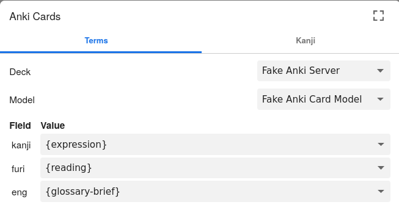

# Yomichan wordlist maker thing

Are you a Japanese learner?
Do you often make vocabulary lists by copy-pasting
or re-typing
words and definitions from your dictionary app?
If so, this small program might make
the process of making vocabulary lists just a tiny bit easier
for you.

[Yomichan](https://foosoft.net/projects/yomichan/)
and its successor
[Yomitan](https://yomitan.wiki/)
are really useful interactive dictionaries.
They are designed to be used as popup dictionaries
on websites,
but can also be launched in standalone mode
by pressing `Alt + Insert`.

Using this program,
you can add Yomichan/Yomitan
vocabulary entries to a text file
by pressing a single button.

## Setup
1. Install Yomichan or Yomitan and add dictionaries
1. Download the `server.py` file from this repo
1. Run the `server.py` file like so:
    `python3 server.py`
    (No additional dependencies are required, just python3)
    If you're not familiar with using command-line programs,
    read [for-newbies.md](for-newbies.md)
1. Open Yomichan/Yomitan preferences,
    enable "Anki Integration",
    and configure the "Anki card format" like so:
    
1. Now you can click the green "plus" button
    or press `Alt + E` on Yomichan dictionary entries,
    and they will be added to the file
    `yomichan_notes.tsv`
    in the directory that you launched the server from.

## Special Thanks

Thank you Foxu for making the original PHP version of this script!

## License

You should have received a copy of the CC0 Public Domain Dedication
along with this software.
If not, see <http://creativecommons.org/publicdomain/zero/1.0/>.

COPYLEFT 🄯 2024 MAYBETREE ALL WRONGS DESERVED.

